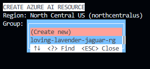
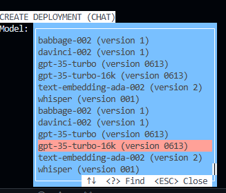

# 2. Create AI Project Resources
## Pre Requisites

First, let's create our own Python virtual enviroment. 

```
python -3 -m venv .venv
.venv\scripts\activate
```

Now, install all of the required packages on `requirements.txt`.

```
pip install -r requirements.txt
```

Finally, install the Azure AI CLI. 

- On Linux:

```
curl -sL https://aka.ms/InstallAzureAICLIDeb | sudo bash
```

- On Windows or Mac, follow the instructions at [here](https://aka.ms/aistudio/docs/cli).

## 2.1 Azure AI CLI `help`
1. **Validate Azure AI CLI.** Type `ai help` in the terminal in Visual Studio Code to validate it installed correctly. You should see an interactive help experience as shown below:


    

2. **To quit AZ CLI.** Hit `Esc` to exit the interactive CLI.

3. . **View Azure AI CLI Commands.** 
 _Note: This instance was captured in Nov 2023 - newer releases may have different output_.

    ```bash
    USAGE: ai <command> [...]                                       
                                                                    
    HELP                                                            
                                                                    
    ai help
    ai help init

    COMMANDS

    ai init [...]             (see: ai help init)
    ai config [...]           (see: ai help config)

    ai dev [...]              (see: ai help dev)

    ai chat [...]             (see: ai help chat)
    ai flow [...]             (see: ai help flow)

    ai search [...]           (see: ai help search)
    ai speech [...]           (see: ai help speech)

    ai service [...]          (see: ai help service)

    EXAMPLES

    ai init
    ai chat --interactive --system @prompt.txt

    ai search index update --name MyIndex --files *.md
    ai chat --interactive --system @prompt.txt --index-name MyIndex

    ADDITIONAL HELP

    ai help examples

    ai help find "prompt"
    ai help find "prompt" --expand

    ai help find topics "examples"
    ai help list topics

    ai help documentation
    ```

4. **Get Help For Specific Command.** Use `ai help <command>` to get the interactive help experience for that specific command. Here is what that looks like for `ai help init` (in interactive mode).

    

    ```bash
    INIT  
                                                                                                       
    The ai init command allows interactive and non-interactive selection or creation of Azure AI Services resources.                                                                                               

    When an AI resource is selected or created using this command, the associated resource keys and region are retrieved and automatically stored in the local AI configuration datastore.                                                                           
    USAGE: ai init [...]                                                                                                    

    AZURE                                                                                                                                                                                            
        --subscription SUBSCRIPTION      (see: ai help init subscription)    

    INTERACTIVE

        --interactive BOOL            (see: ai help init interactive)             
                                                                                                                                                                  
    RESOURCE                                                                                                                                                                                                                                                                                                    
        --region region               (see: ai help init region)                                                                                                                                             
        --group GROUP                 (see: ai help init group)                                                                                                                                             
        --name NAME                   (see: ai help init name)                                                                                                
                                                                          
    EXAMPLES
                                                            
    EXAMPLE 1: interactively select or create an Azure AI resource                                                                                     
    ai init
                                                                           
    EXAMPLE 2: interactively select a resource matching a set of criteria 

    ai init --name "ai-westus2" --region westus2

    SEE ALSO 
                                                                                 
    ai help config
    ai help config hive
    ai help init advanced
    ai help init examples
    ai help find topics init
    ```

## 2.2 Create Azure AI Resource

Create (and/or connect to) your Azure AI Project and related resources by using `ai init`.

1. After hitting `Enter`, the CLI will ask how you wish to initialize it. For this guide, use `New AI Project`

    

2. Then, if you are not logged in, it will ask you to login to your Azure account. Choose your preferred method.

    

3. Now, select how you want to generate your service. In this guide, we are going to use the integrated OpenAI + AI Services. Choose your region, remember to choose one with quota for your resources. Learn about OpenAI quotas [here](https://learn.microsoft.com/en-us/azure/ai-services/openai/quotas-limits?WT.mc_id=academic-0000-pablolopes)

    

4. Create your group for our application, add a name for the Azure AI application and project

    

    

    

5. Create the OpenAI instances:

    - For this demo, you need to create the chat, embeddings and evaluation systems. 

    - First, create the Chat instance, for this model use `GPT-3.5-turbo-16k (Model 0613)` and add a name to it.

        

        

        


    - Now, create the Embeddings instance, for this model use `text-embedding-ada-002 (Version 2)` and add a name to it.

        

        

        

    - For last, add the Evaluation instance, use the chat before

        

    - Now, the terminal will deliver the output to the system.

        

6. Now, create an AI Search 

    

    

    

    

If everything was setup correctly, we should see our `json` configurations in the terminal and ready for the next step!


Now, be ready to [Build the Search Index](./03-build-search-index.md)