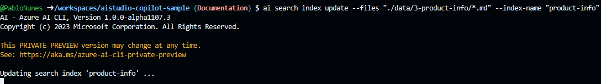
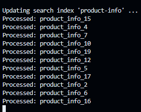
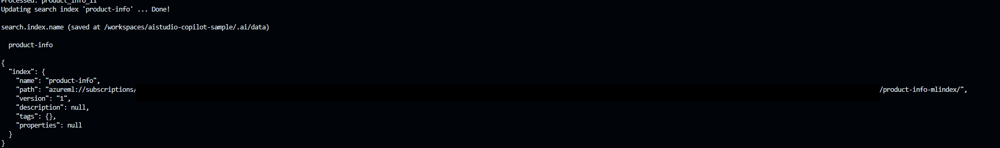
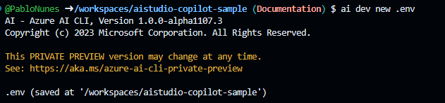

# 3. Build Search Index from data

## 3.1 Creating the data retrieval

Great, we are now set-up to start to add information to our Azure AI system. Do this with the following steps.

1. Run the following command

    `ai search index update --files "./data/3-product-info/*.md" --index-name "product-info"`

    Some explanations:

    - We are using the `ai search index update`. This is adding to our system the indexation of the product specified on the rest of the CLI request.
    - The `--files "./data/3-product-info/*.md" --index-name "product-info` is both getting the markdown files on the folder of product info and indexing this as `product-info` to our Search service.

    

2. While processing, it will update with the status indexing the documents in the folder.

    

3. When done, will show the following with the sucessful indexing status.

    

## 3.2 Creating the AI Virtual Enviroment

With everything ready, create your `.env` to create the PromptFlow connections and create the resources to be used with our code.

Run the following command  `ai dev new .env` to create the new enviroment file.

With this, congratulations! 
Now, we can test our RAG with PromptFlow, go [test with a question](./04-run-copilot-question.md)!