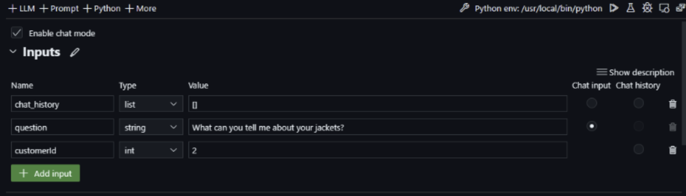
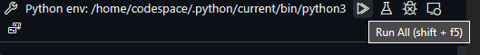

# 4. Run Copilot with RAG
## 4.1 What is Promptflow? 

[Promptflow](https://microsoft.github.io/promptflow/index.html) is a suite of development tools designed to streamline the end-to-end development cycle of LLM-based AI applications, from ideation, prototyping, testing, evaluation to production deployment and monitoring.

With prompt flow, you will be able to:

- Create and iteratively develop flow
    - Create executable [flows](https://microsoft.github.io/promptflow/concepts/concept-flows.html) that link LLMs, prompts, Python code and other [tools](https://microsoft.github.io/promptflow/concepts/concept-tools.html) together.
    - Debug and iterate your flows, especially the [interaction with LLMs](https://microsoft.github.io/promptflow/concepts/concept-connections.html) with ease.
- Evaluate flow quality and performance
    - Evaluate your flow's quality and performance with larger datasets.
    Integrate the testing and evaluation into your CI/CD system to ensure quality of your flow.
- Streamlined development cycle for production
    - Deploy your flow to the serving platform you choose or integrate into your app's code base easily.

## 4.2 Explore PromptFlow connections 

To explore the PromptFlow connections, install the [VSCode extension](https://marketplace.visualstudio.com/items?itemName=prompt-flow.prompt-flow&WT.mc_id=academic-0000-pablolopes).

After installing or using from Codespaces/Containers, you can explore how the connections work. Open the `copilot_promptflow` folder and open the `flow.dag.yaml` file, it should look like this:

Now, enter the visual editor. Click `Visual editor` in the top left of the screen or press `Ctrl + k`.

Take a look on the visual editor for PromptFlow!

Click a node, notice how it selects the corresponding configuration, and you can change variables.

## 4.3 Establish PromptFlow connections

We need to establish the connections with our Azure AI backend, the connections that we are going to establish have the following names:
- `AzureAISearch` -> Cognitive Search Connection
- `Default_AzureOpenAI` -> OpenAI Connection

1. Install the keyrings library to successfully create PromptFlow connections, using `pip install keyrings.alt`

    

2. Click on the `Add Connection` button to create the new connection

    

3. Select the correct connection according to the type, for `AzureAISearch` use Cognitive Search and for `Default_AzureOpenAI` use Azure OpenAI

    

4. Add the endpoint to `api_base`, to check the endpoint and key, check your `.env` in your root folder.

    

    

5. Click on Create Connection in the .yaml file to generate the connection. Add the key to configure and, if sucessfull, will show a log of the connection.

    

    

6. Verify that in the nodes that the correct connections are being selected to avoid any problems.

With this, we should be able to run our demo. Repeat the steps for the two connections.

## 4.4 Run the Demo in PromptFlow

Now, let's experiment with the PromptFlow. 

First, check if the Inputs in the PromptFlow are filled. If not add them to test if the PromptFlow connection is working propely.

If it does not looks like it. Do the following steps.

1. Use the `Add Input` button.

1. Add the `question` input, use the `String` Type.

1. Use the sample question: `What can you tell me about your jackets?`.

1. Now, add the `customerId` input, use the `int` type.

1. Use `2` as the int. 

It should look like the above sample. Now, run the demo with the PromptFlow interface or use `Shift + F5`

Now, it should show the results in the terminal.

## 4.5 Run the Demo in Azure AI

To use the demo, run the following command: 

 `python src/run.py --question "which tent is the most waterproof?" --implementation promptflow`

After running, PromptFlow will print some logs and shows the output.

Now, we can run RAG with PromptFlow! However, how could we test this?

Let's look on how to do it in the next lesson.

